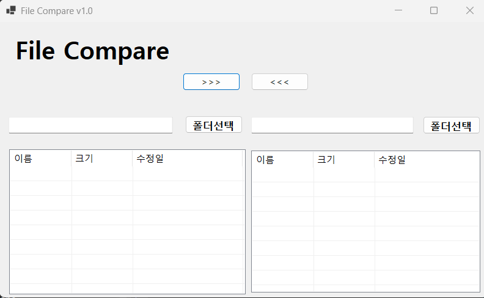
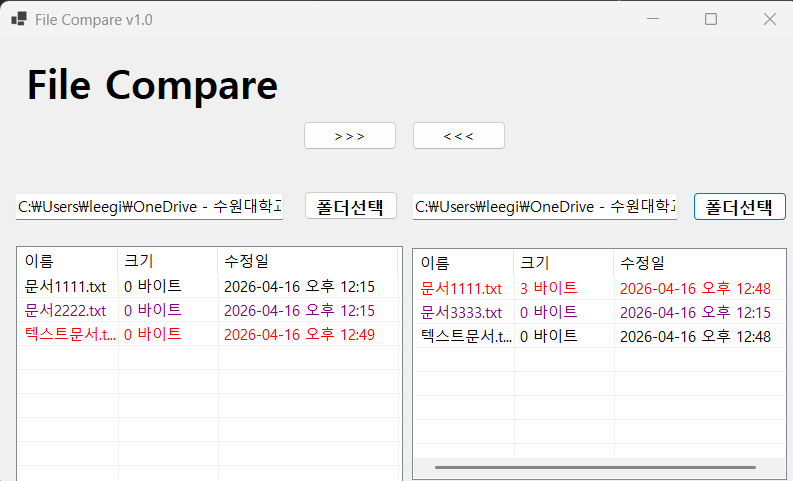
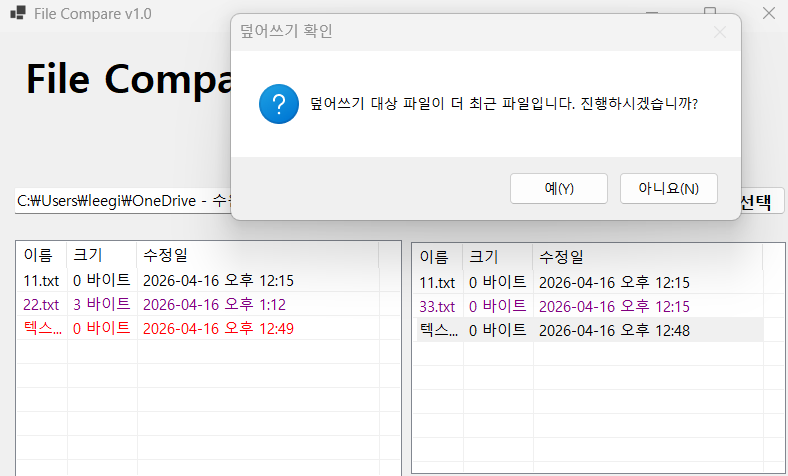

# (C# 코딩)
## 개요
	-C# 프로그래밍학습
	-1줄소개: 사용자키보드입력을받아서처리하는프로그램
	-사용한플랫폼: -C#, .NET Windows Forms, Visual Studio, GitHub
	-사용한컨트롤:-Label, TextBox, ListBox, Button, ListView, MenuStrip, ToolStripMenuItem
	-사용한기술과구현한기능:
		-Visual Studio를이용하여UI 디자인
		-Listview컨트롤을이용하여파일비교시각화
		
## 실행화면(과제1)
-코드의실행스크린샷과구현내용설명

-구현한내용(위그림참조)

	-양쪽 파일을 비교할 수 있는 파일 비교 시스템의 UI를 구축하였다. 
	-각 컨트롤을 용도에 맞게 배치하였고 기능 구동을 확인하였다.

## 실행화면(과제2)
-코드의실행스크린샷과구현내용설명

-구현한내용(위그림참조)

	-폴더 선택 버튼을 눌렀을 때 그 파일을 불러와서 파일 리스트에 추가하는 기능을 구현하였다.
	-파일의 최근 수정 여부에 따라 다양한 색깔로 볼 수 있게 하였다.

## 실행화면(과제3)
-코드의실행스크린샷과구현내용설명

-구현한내용(위그림참조)

	-복사 덮어쓰기 버튼을 눌렀을 때 파일이 복사되는 기능을 구현하였다.
	-덮어쓰려는 파일이 더 최근일 경우 메시지박스로 한번 더 확인하는 기능을 구현하였다.

